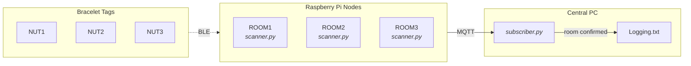

# BlueBot

## Overview

Indoor room level location tracking for BLE bracelet tags using a network of Raspberry Pi nodes. Each Pi is placed in a room and continuously scans for BLE tags worn on mobile objects. Distance is estimated from RSSI and smoothed with a Kalman filter. A central subscriber collects readings from all Pis over MQTT and determines which room each bracelet is in, logging confirmed transitions when the same room is detected consistently.

## System Architecture

