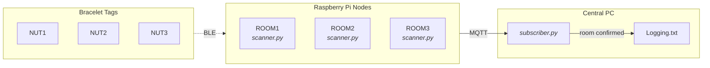

# BlueBot

# Overview

Indoor room level location tracking for BLE bracelet tags using a network of Raspberry Pi nodes. Each Pi is placed in a room and continuously scans for BLE tags worn on mobile objects. Distance is estimated from RSSI and smoothed with a Kalman filter. A central subscriber collects readings from all Pis over MQTT and determines which room each bracelet is in, logging confirmed transitions when the same room is detected consistently.

# System Architecture



# Deployment

## Scanner: Raspberry Pi Nodes

The node reads its room name, broker IP, and tag list from `config/nodes.yaml` using its hostname as the key.

Each Pi needs:
- The `scanner/`, `shared/`, and `config/` directories from this repo
- Python 3.9+ and dependencies installed

```bash
# Install dependencies
sudo apt install mosquitto mosquitto-clients
sudo pip install bluepy paho-mqtt pyyaml

# Set the hostname to match its entry in config/nodes.yaml
sudo hostnamectl set-hostname rpi1

# Run (requires root for BLE hardware access)
sudo python scanner/scanner.py config/nodes.yaml
```

## Subscriber: Central PC

The subscriber runs on any machine on the same network as the Pis.

```bash
# Install dependencies
pip install paho-mqtt pyyaml

# Run
python subscriber/subscriber.py config/subscriber.yaml
```

Output is written to:
- `Logging.txt` for confirmed room transitions
- `SubLog.txt` for full debug output

# Configuration

All nodes are defined in one file: `config/nodes.yaml`. Each node is keyed by its hostname and specifies the room name and broker host it connects to.

BLE tag MAC addresses and shared settings (Kalman parameters, MQTT port, scan duration) live under `defaults` in the same file and apply to every node automatically.

To add a new room add a new block:

```yaml
nodes:
  rpi4:
    room_name: "ROOM4"
    broker_host: "192.168.0.200"
```
